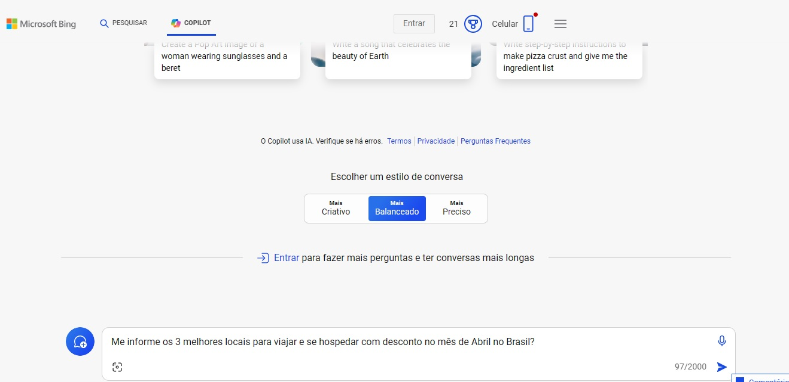
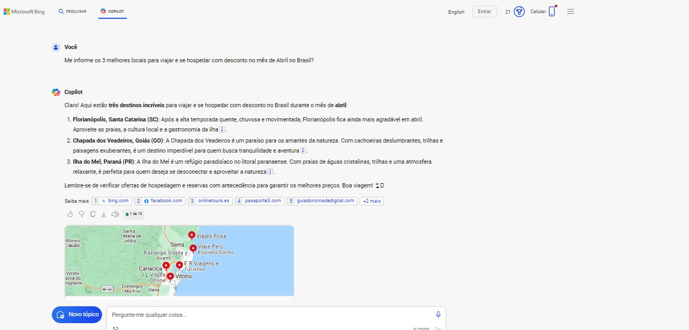
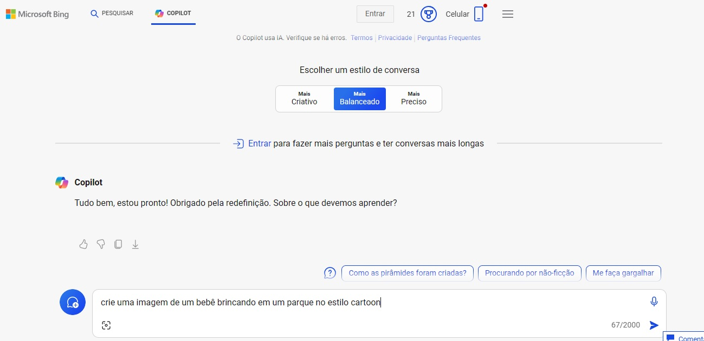
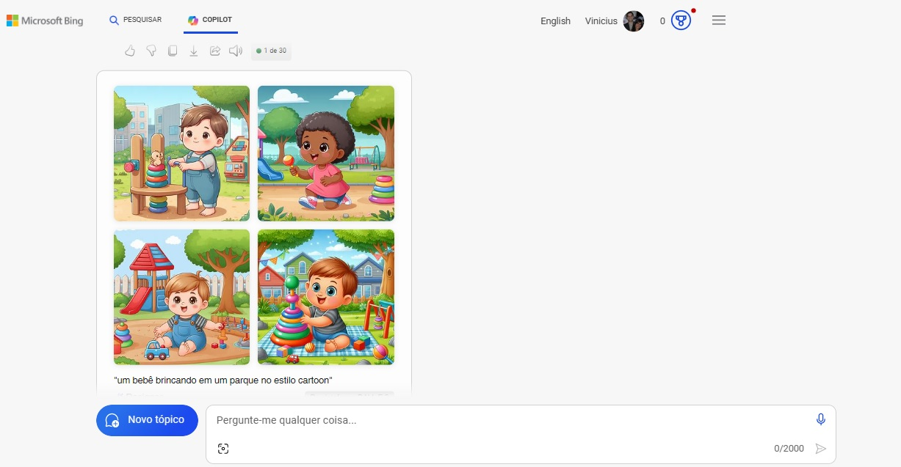
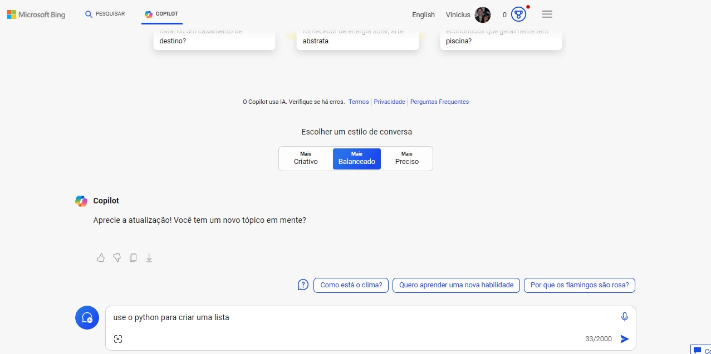
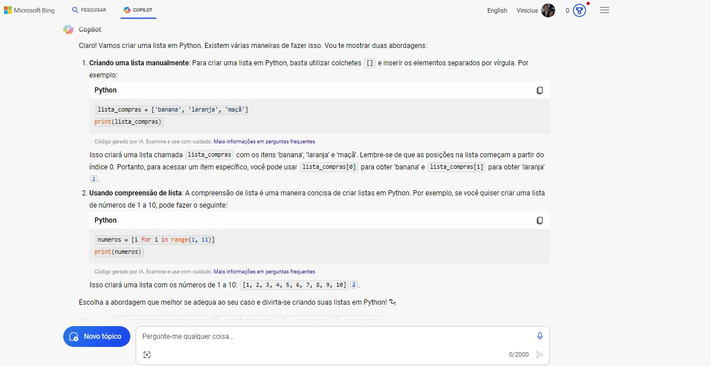
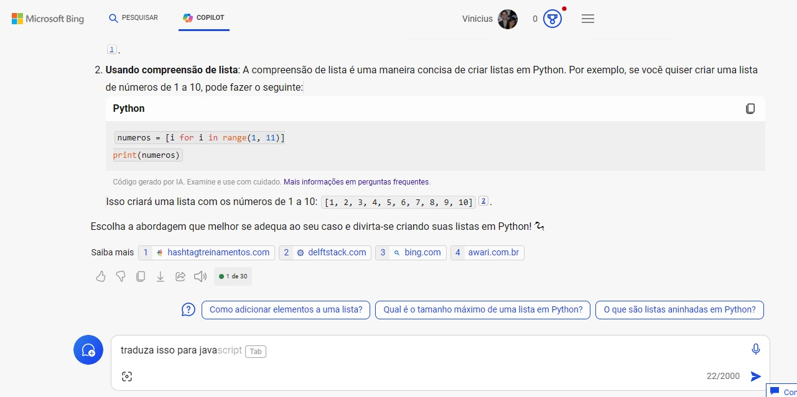
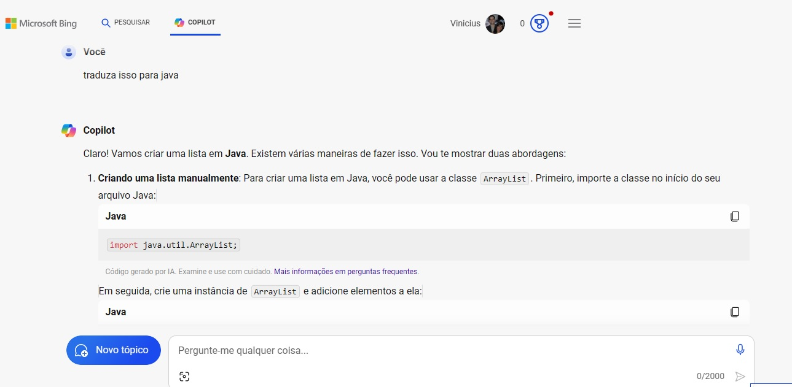
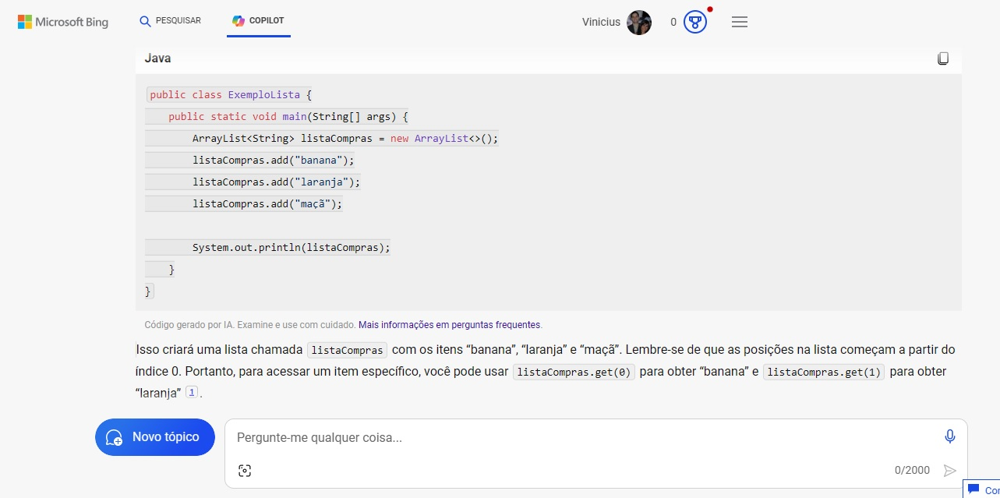
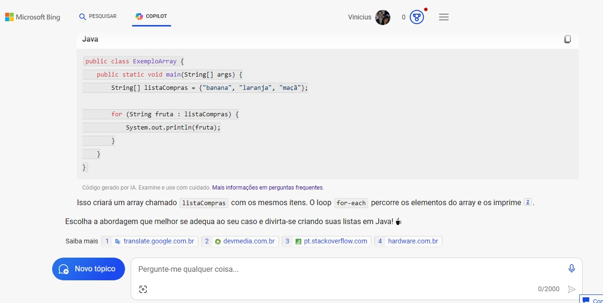

# Laboratório Explore a IA generativa com o Microsoft Copilot

## Resumo
Projeto que explorará a IA generativa com o Microsoft Copilot, como desafio de projeto da DIO.

Laboratório da Microsoft [Explore a IA generativa com o Microsoft Copilot](https://microsoftlearning.github.io/mslearn-ai-fundamentals/Instructions/Labs/12-generative-ai.html)

## Processo

- As imagens dos prompts estão localizadas na pasta **inputs**;
- As imagens geradas como respostas estão na pasta **outputs** do projeto.

1. **Faça o login no Microsoft Copilot**: Faça login no [Microsoft Copilot](https://copilot.microsoft.com/?azure-portal=true)

2. **Uso do prompt para gerar respostas**: 
Abaixo o print da pergunta e em seguida a resposta gerada: **Me informe os 3 melhores locais para viajar e se hospedar com desconto no mês de Abril no Brasil?**
- 
- 

3. **Geração de imagens**:
Abaixo o print do prompt e em seguida a resposta gerada: **crie uma imagem de um bebê brincando em um parque no estilo cartoon**
- 
- 

4. **Geração de código**:
Abaixo o print prompt e em seguida a resposta gerada: **use o python para criar uma lista**
- 
- 

Abaixo o print prompt e em seguida a resposta gerada: **traduza isso para java**
- 
- 
- 
- 
## Insights Principais

- As IAs generativas ajudam tanto em tarefas cotidianas como em atividades criativas
